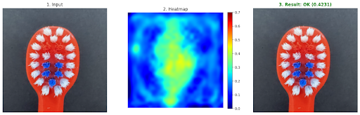

# Toothbrush AOI 瑕疵檢測系統

本專案是一個基於 **PatchCore** 演算法的自動光學檢測 (AOI) 系統，專門用於牙刷生產線的品質控管。系統整合了 **Sentech** 工業相機進行即時影像抓拍，並透過深度學習模型識別產品瑕疵。

## 版本說明

本專案包含兩個版本：

| 版本 | 檔案 | 說明 |
|------|------|------|
| **原始版本** | `main.ipynb` | Jupyter Notebook 版，適合開發與實驗，整合訓練、推論與視覺化 |
| **生產版本** | `main.py` + `auto_snap.py` | 拆分為自動拍照（資料蒐集）與即時推論兩個腳本，適合部署於生產線 |

## 展示結果

以下為系統實際偵測輸出範例（存於 `demo_result/`），每張圖包含原始影像、熱力圖與判定結果：


.png)
.png)
.png)
.png)
.png)

## 📂 資料夾結構

```
toothbrush_aoi/
├── main.ipynb          # 原始 Notebook 版本（開發/實驗用）
├── main.py             # 生產版：即時推論主程式
├── auto_snap.py        # 生產版：自動化資料蒐集腳本
├── train.py            # PatchCore 模型訓練腳本
├── requirements.txt    # Python 套件清單
├── Sentech/            # Sentech 工業相機 SDK
├── background/         # 背景參考圖片（影像處理用）
├── demo_result/        # 系統偵測輸出範例
├── detected/           # 即時推論結果輸出目錄
├── datasets/           # 訓練資料集（.gitignore 排除）
├── results/            # 訓練歷程與模型評估指標（.gitignore 排除）
├── images/             # auto_snap.py 抓拍的原始暫存影像（.gitignore 排除）
└── model.ckpt          # 訓練完成的模型權重（.gitignore 排除）
```

## 📄 主要檔案說明

### `main.ipynb` — 原始 Notebook 版本
整合所有流程（資料前處理、訓練、推論、視覺化）於單一 Notebook，方便研究與實驗。

### `auto_snap.py` — 自動資料蒐集工具（生產版）
控制 Sentech 工業相機，偵測產品進入畫面並靜止後自動截圖，儲存至 `./images/`。截圖後進入冷卻等待下一個產品。

**主要邏輯：**
- 偵測 ROI 區域內的動態（Motion Score）與產品存在（Presence Area）
- 物體靜止超過設定幀數（`STABLE_CONSECUTIVE_FRAMES`）即自動截圖
- 支援 Sentech 相機或影片檔作為輸入來源

### `main.py` — 即時推論主程式（生產版）
載入已訓練的 PatchCore 模型，對 Sentech 相機輸入進行即時瑕疵偵測，輸出含熱力圖與標示框的報告圖至 `./detected/`。

**主要優化：**
- 使用 SDK SIMD 加速進行 Bayer → BGR 影像轉換
- 非同步推論（`threading`）不阻塞主迴圈
- Semaphore 限制並發存圖數量，防止記憶體溢出

### `train.py` — 模型訓練腳本
使用 [Anomalib](https://github.com/openvinotoolkit/anomalib) 框架訓練 PatchCore 模型。

**主要設定：**
- Backbone: `wide_resnet50_2`
- 訓練資料路徑: `./datasets/train/multi_good/`
- 輸出路徑: `./results/`

## 🚀 工作流程 (Workflow)

```
1. 資料蒐集   →   2. 人工篩選   →   3. 模型訓練   →   4. 即時檢測
auto_snap.py       ./images/          train.py           main.py
   ↓                  ↓                  ↓                  ↓
./images/         ./datasets/        ./results/          ./detected/
```

1. **資料蒐集**: 執行 `python auto_snap.py`，透過 Sentech 相機採集牙刷影像存入 `./images/`
2. **人工篩選**: 從 `./images/` 挑選有效影像，移至 `./datasets/train/multi_good/`
3. **模型訓練**: 執行 `python train.py`，模型與訓練記錄存於 `./results/`
4. **即時檢測**: 執行 `python main.py`，瑕疵報告圖輸出至 `./detected/`

## ⚙️ 環境設定

本專案建議使用 Python 虛擬環境（開發環境為 Ubuntu，亦支援 Windows）：

```bash
# 建立虛擬環境
python3 -m venv toothbrush

# 啟動虛擬環境 (Linux/macOS)
source toothbrush/bin/activate

# 啟動虛擬環境 (Windows)
toothbrush\Scripts\activate

# 安裝必要套件
pip install -r requirements.txt
```

> **注意**: Sentech 相機 SDK (`stapipy`) 需單獨安裝，請參考 `Sentech/` 資料夾內的說明或官方文件。

## 🔧 主要參數設定

在 `main.py` 和 `auto_snap.py` 的開頭可調整以下參數：

| 參數 | 預設值 | 說明 |
|------|--------|------|
| `USE_SENTECH_CAMERA` | `True` | `True` 使用 Sentech 相機，`False` 使用影片檔 |
| `ROI_RECT` | `(1500, 800, 1000, 1300)` | 偵測區域 (x, y, w, h) |
| `THRESHOLD` | `50` | 瑕疵判定閾值（僅 `main.py`） |
| `STABLE_CONSECUTIVE_FRAMES` | `10` | 連續靜止幾幀才觸發截圖/推論 |
| `DIFF_THRESHOLD` | `30` | 背景差分閾值 |

## 🛠️ 技術棧

- **深度學習框架**: [Anomalib](https://github.com/openvinotoolkit/anomalib) v2.2.0 + PyTorch 2.10
- **異常偵測演算法**: PatchCore（Backbone: WideResNet-50-2）
- **影像處理**: OpenCV 4.13
- **工業相機**: Sentech GenTL / stapipy SDK
- **訓練加速**: CUDA 12 / PyTorch Lightning 2.6
